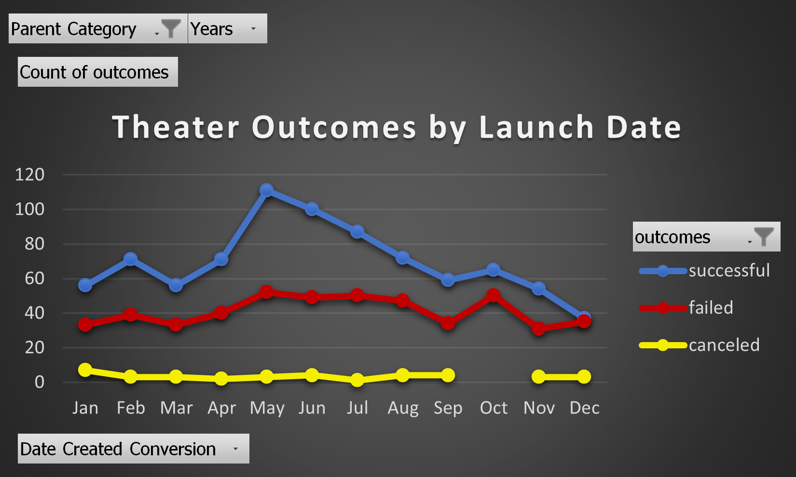
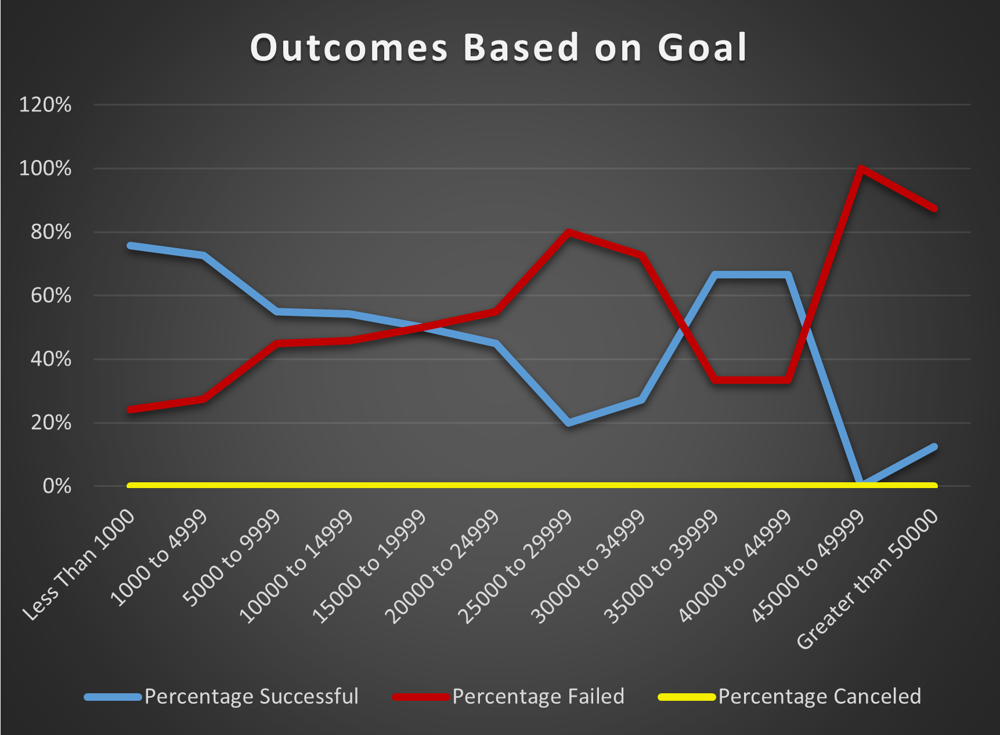

# kickstarter-analysis
Performing analysis on Kickstarter data to uncover trends.
# Kickstarting with Excel

## Overview of Project
Analyze kickstarter dataset (crowdfunding data) to help answer questions from Louise. 
Louise has started her own crowdfunding campaign to fund her play Fever.
Louise’s play Fever came close to its fundraising goal in a short amount of time and she would like to understand how different campaigns fared in relation to their funding goals.
### Purpose
Perform an analysis of outcomes based on launch date and outcomes based on goals to help Louise understand how different campaigns fared in relation to their launch dates and their funding goals.

## Analysis and Challenges

The full analysis can be viewed here [Kickstarter-challenge](Kickstarter_Challenge.zip)

### Analysis of Outcomes Based on Launch Date

Visualize campaign outcomes ("successful," "failed," and "canceled") for theater category based on launch date and grouped by month.  

---
### Analysis of Outcomes Based on Goals

Visualize the percentage of successful, failed, and canceled plays based on the funding goal amount (ranges).

  
---
### Challenges and Difficulties Encountered
Possible challenges could arise if we tried to do deeper dive to understand why some campaigns failed while others were successful. Also trying to understand why campaings were canceled would be difficult as there is no reason for cancellation.

## Results

- What are two conclusions you can draw about the Outcomes based on Launch Date?

   *1. The most number of successful kickstarter campaings in the theater category have been launched in May.*
   
   *2. The least successful month to launch a kickstarter campaign in ther theater category seems to be December.*

- What can you conclude about the Outcomes based on Goals?

  *The highhest number of kickstarter projects under plays subcategory (534) had a goal between 1000 and 4999 and 73% (388) of these kickstarter projects have been successful.
  Total of 16 kickstarter projects under plays subcategory had goal grater than 50000 and 88% (14) of these kickstarter projects failed.*
  
- What are some limitations of this dataset?

  *This dataset is missing columns description. 
  This dataset does not provide any other variables that would provide a deeper dive into reasons why particular campaign was or was not successful. More data should be collected to better understand why campaign has failed. It might be a good idea to collect: reason for cancellation, donation type/method, crowdfunding method/site, etc.*

- What are some other possible tables and/or graphs that we could create?

  *We could look at average donation by category and subcategory and/or by outcome.
  We could look at average campaing time of successful campaigns by category/subcategory and/or by goal ranges.
  We could look at the average number of backers by category/subcategory and/or by month.*
  
